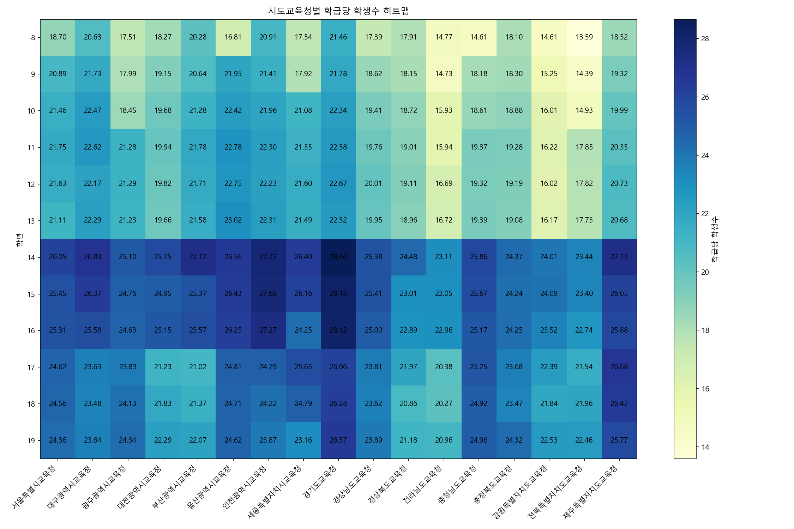

# 🏫 시도교육청별 학급당 학생수 분석 및 시각화

Python과 [학교알리미](https://www.schoolinfo.go.kr/)의 **학년별·학급별 학생수 데이터**를 활용하여,  
전국 시도교육청별 **초·중·고등학교의 학급당 학생 수 현황을 시각화**하는 프로그램입니다.  

---

## 📊 개요

본 프로그램은  
학교알리미 > 공개용 데이터 > **학사/학생 > 학년별·학급별 학생수**  
에서 내려받은 CSV 파일(`초등학교`, `중학교`, `고등학교`)을 활용합니다.  

각 교육청별로 학년별 학급수와 학생수를 집계하여,  
**학급당 평균 학생 수를 계산**하고, 이를 **히트맵 형태로 시각화**합니다.

---

## 📁 데이터 준비

> 🔗 데이터 출처: [학교알리미](https://www.schoolinfo.go.kr/)

**경로:**  
`학교알리미 > 공개용 데이터 > 학사/학생 > 학년별·학급별 학생수`

**조건:**  
- 시도교육청: 전체  
- 학교급: 초등학교, 중학교, 고등학교 각각 조회  
- 파일 형식: CSV (예: `2024_Grade_Class_Elem.csv`, `2024_Grade_Class_Middle.csv`, `2024_Grade_Class_High.csv`)

---

## ⚙️ 실행 방법

1️⃣ Python이 설치된 환경에서 아래 파일을 준비합니다.

```

2024_Grade_Class_Elem.csv
2024_Grade_Class_Middle.csv
2024_Grade_Class_High.csv
students_per_class_heatmap.py

````

2️⃣ 터미널 또는 명령 프롬프트에서 실행:

```bash
pip install pandas
pip install numpy
pip install matplotlib
pip install seaborn
python students_per_class_heatmap.py
````

3️⃣ 실행 결과:

* 시도교육청별_학급당_학생수_히트맵.png 파일이 생성됩니다.
* 프로그램 창에 히트맵이 표시됩니다.

---

## 🔍 주요 기능

| 기능             | 설명                              |
| -------------- | ------------------------------- |
| 📂 CSV 데이터 로드  | 학교알리미 공개 데이터 자동 읽기              |
| 🧱 교육청별 집계     | 초/중/고 시도교육청 단위로 집계              |
| 🧮 학급당 학생 수 계산 | (학생 수 ÷ 학급 수) 계산                |
| 🎨 시각화         | seaborn 또는 matplotlib 기반 히트맵 생성 |
| 💾 자동 저장       | 결과 이미지를 PNG 파일로 저장              |

---

## 🧠 학습 포인트

* `pandas`를 활용한 CSV 데이터 전처리 및 그룹화
* `matplotlib` / `seaborn`을 통한 데이터 시각화
* `groupby`, `merge`, `apply` 등 고급 데이터 처리 기법
* Windows 환경에서 한글 폰트(`맑은 고딕`) 설정 방법

---

## 🧩 코드 파일 구조

```plaintext
students_per_class_heatmap.py     # 메인 분석 및 시각화 코드
2025_Grade_Class_Elem.csv             # 초등학교 학년별·학급별 학생수 데이터
2025_Grade_Class_Middle.csv           # 중학교 학년별·학급별 학생수 데이터
2025_Grade_Class_High.csv             # 고등학교 학년별·학급별 학생수 데이터
README.md                             # 프로젝트 설명 파일 (본 문서)
```

---

## 🪄 출력 예시

아래는 실행 시 생성되는 히트맵 예시입니다.
(시도교육청별, 초~고 학년별 학급당 평균 학생 수를 시각적으로 비교)



---

## 🧑‍💻 개발 정보

* **개발자:** 성서고등학교 교사 강준호
* **이메일:** [junh048@dge.go.kr](mailto:junh048@dge.go.kr)
* **개발 언어:** Python 3.x
* **라이브러리:** pandas, numpy, matplotlib, seaborn

---

## ✨ 확장 아이디어

* 📈 특정 시도교육청만 선택해서 비교 분석
* 📅 연도별(2023 vs 2024) 변화 추세 시각화
* 📤 분석 결과를 Excel 또는 CSV로 자동 저장
* 🧭 Streamlit 또는 Tkinter로 GUI 대시보드 구현

---

## 📜 라이선스

본 프로그램은 **비영리 교육용**으로 자유롭게 사용하실 수 있습니다.
데이터 출처는 [학교알리미](https://www.schoolinfo.go.kr/)를 명시해야 합니다.

---

> 📚 교육 현장이나 데이터 리터러시 수업에서

> Python과 공공 데이터를 활용한 **실제 데이터 분석 프로젝트**로 추천드립니다.


